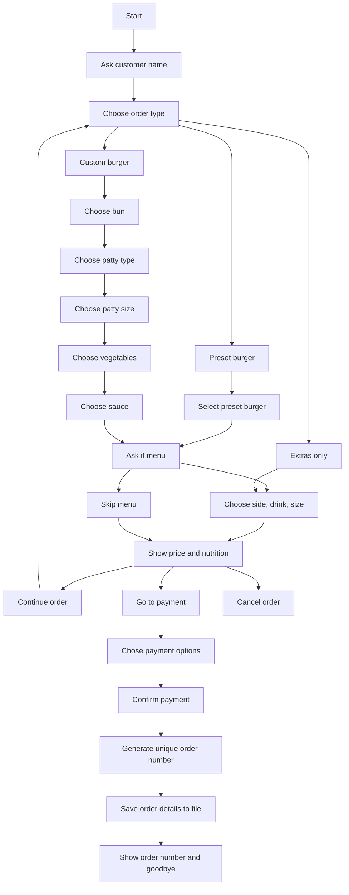

# Best burger
## A project made by Group-H from FHNW
### Idea
Our Idea stems from the desire to create the Best Burger to satisfy every type of dietary requirement. 

To do this, we’ve developed this program where customers can choose to build their own burger from scratch or select one of the options we’ve already created.

Customers can choose to pair the burger with a side dish and a drink to create a meal, or purchase just the burger. Once they have made their selection, they will see the nutritional information and price before proceeding to checkout.

### problem we try to solve
We want to build a kiosk machine software where people can customize their desired burger or menu at peace, exactly as the indidual desires. It's important for the clients to know in real time the nutritional values they have on their plate each time, to offer transparency over how the menu is composed, so people can balance as they need.

👤 User Roles
| Role | Description |
|------|-------------|
| **Customer** | Orders burgers and wants to know what they have ordered, how much they need to pay and nutritional values of the order. |
| **Owner** | Runs the Burger shop, maintains the menu, keeps records of all sales and checks weekly reports. |

🏗️ User stories:
Andrei Cosmin Parnia:
1. As a customer, I want to have right data about orice, nutritional values and allergens, so that I can adjust the order.
2. As an owner, I want to have an admin pannel, so that I can check the orders.
3. As an owner, I want to have a weekly report with the sales, so I can take data driven decisions on existing and new products.

Filippo Paccagnella
1. 
2. 
3. 

Andrei Oros.
1. 
2. 
3. 

### Structure


#### Function tree

```text
best_burger/
├── main.py
├── menu_data.py
├── calculators.py
├── order.py
├── data/
│   ├── ingredients.csv
│   ├── preset_burgers.csv
│   ├── sides.csv
│   ├── drinks.csv
│   └── orders.csv
└── README.md
```

### how it works
The program starts by asking for the customer's name. Then the customer chooses between a preset burger, a custom burger, or extras only.

For preset burgers, the customer selects one of the available burgers and can add a menu with sides and a drink.

For custom burgers, the customer chooses the bun, patty, patty size, vegetables, and sauce. After that, they can add sides and a drink.

Before finishing, the program shows the total price and nutritional values. The customer can continue ordering, cancel the order, or choose a payment method. After the payment method is selected, the program generates a unique order number and saves the order details to a file.

